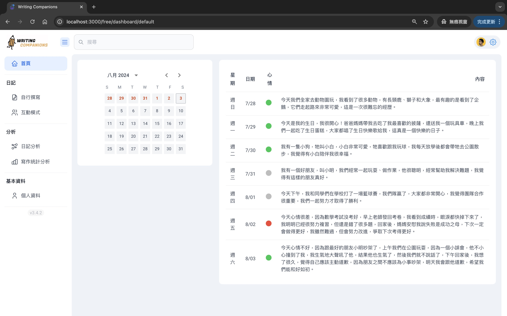
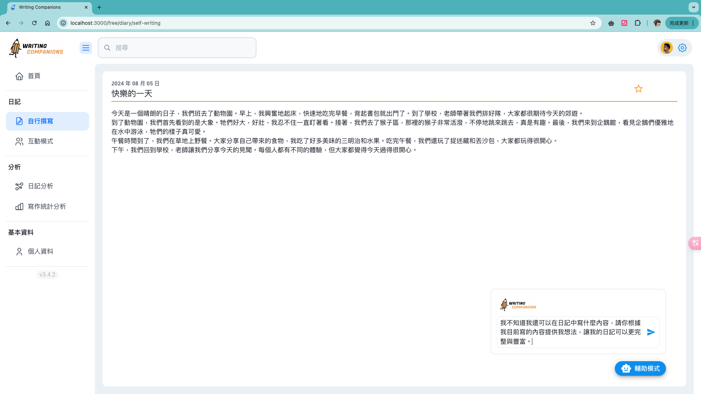
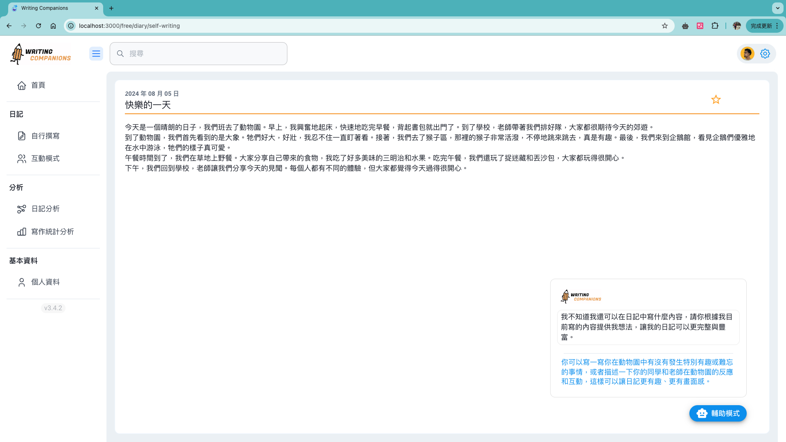
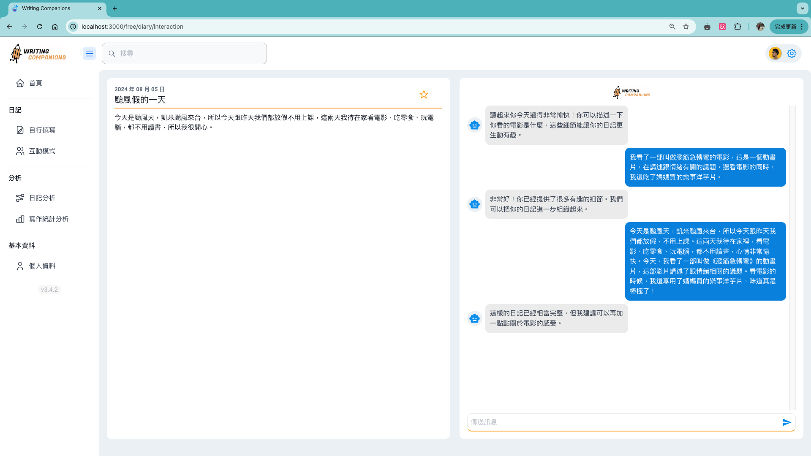

# AI Writing Companion


## What Is AI Writing Companion

Writing Companion is an AI-powered writing practice platform designed specifically for elementary school students. It provides interactive features to enhance students' writing skills through guided exercises, analytics, and personalized feedback.

## ⚙️ Features

- **Calendar-Based Journal**: Helps students organize and review their past entries.

- **Self-Writing Mode**: Allows students to write independently with AI feedback.

- **Interactive Mode**: Engages students with guided prompts and suggestions.

- **Diary Analysis**: AI-driven insights to help students reflect on their daily writing.

- **Writing Statistics Analysis**: Provides detailed progress tracking through data visualization.

- **Personal Profile**: Stores students' personal information, such as their name, class, and teacher's name. Also includes fundamental features like resetting passwords.

## 📷 Screenshots
|||
|:----------------------------------------:|:-----------------------------------------:|
|  |  |
|  |  |
|  |  |
## Tech Stack

- **Frontend**: React.js

- **Backend**: Django

- **Database**: MySQL

## 📦 Getting Started

### Prerequisites

Ensure you have the following installed on your system:

- NodeJS

- Python & pip

- MySQL

### Setup Instructions

1. **Clone the repository**

   ```sh
   git clone https://github.com/chung-coder/writingCompanion.git
   cd writing-companion
   ```

2. **Backend Setup**

   ```sh
   cd backend
   python -m venv venv
   source venv/bin/activate  # On Windows: venv\Scripts\activate
   pip install -r requirements.txt
   python manage.py migrate
   python manage.py runserver
   ```

3. **Frontend Setup**

   ```sh
   cd frontend
   npm install
   npm start
   ```

4. **Database Configuration**

   - Update `DATABASES` settings in `backend/settings.py` with your MySQL credentials.

   - Create the database and apply migrations:

      ```sh
      python manage.py makemigrations
      python manage.py migrate
      ```

## Usage

1. Access the frontend via `http://localhost:3000`

2. Interact with AI-powered writing exercises

3. Monitor progress through the dashboard

## ⭐ Help us improve the project better

- Please discuss your concerns with me on [LinkedIn](https://www.linkedin.com/in/tingchen-yen) before creating a new issue. 😉

- Please STAR⭐️ the repository if you like the content and code 😁

## License

This project is licensed under the MIT License - see the [LICENSE](LICENSE) file for details.